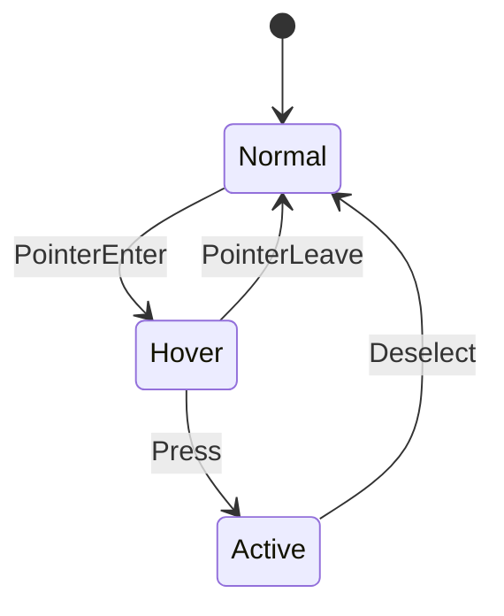
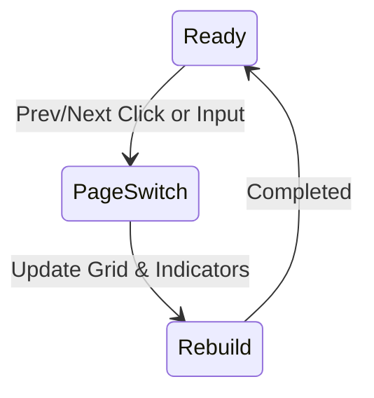

# MyMMO UI構成おすすめ（GothicUI 使用）

本ドキュメントは、`Content/GothicUI/UIelements/` と `Content/GothicUI/UIicons/` に含まれる素材を用いて、現在のMMO系UIを構成するためのおすすめ例を示します。各セクションで使用アセットとレイアウトの意図、実装メモ（UMG/Slate想定）を記載します。

- 対象アセットディレクトリ
  - `Content/GothicUI/UIelements/`
  - `Content/GothicUI/UIicons/`

---

## 1. 全体スタイルガイド
- カラーパレット（推奨）
  - ベース: 黒/ダークグレー系（`T_Backgroud_Black`, `T_Backgroud_wall`）
  - アクセント: 金・黄（`T_Button_plus_yellow`, `T_Energy_Line_yellow`）, 赤（HP系）, 青（MP系）
- 装飾・枠線
  - エリート枠パーツ: `T_Frame_elite_top`, `T_Frame_elite_bot`, `T_Frame_elite_left`, `T_Frame_elite_right`, `T_Frame_elite_topleft`, `T_Frame_elite_topright`, `T_Frame_elite_botleft`, `T_Frame_elite_botright`
  - トレーサリー（装飾線）: `T_Tracery_1`, `T_Tracery_2`, `T_Shadow_Line_Dark`
- フォント/タイポグラフィ
  - 視認性優先。タイトル太字、本文中太さ中。セリフ系UIに調和する中世風フォントを検討。
- レイアウト原則
  - 画面左右にサポートバー（`T_left_sup_bar`, `T_Right_sup_bar`）
  - 余白と9スライス（Scale Box + `Margin`）でリスケール対応

### Screen設定指針（UMG）
- Atomic Widget（ボタン/スロット/小さなウィジェット）: `Desired on Screen`
- 固定サイズパネル（スキルバー領域/大型フレーム/ウィンドウ）: `Custom on Screen`
- 画面全体に広げる背景等: `Fill Screen`

備考: DPIは `Rule: ShortestSide` を推奨し、解像度に応じて SizeBox/Anchors で最小/最大を調整する。

実装メモ（UMG）
- Image(Brush)に`Draw As: Box`設定（Nine-Slice）で伸縮耐性。
- 共通`WidgetStyle`として、ボタン/フレーム/ツールチップのスキンをData Asset化。
- DPIスケーリングを`Rule: ShortestSide`で調整。

---

## 2. ヘッダー/トップバー（通知・メニュー）
- 背景/バー
  - `T_Top_bar`, `T_Top_bar_glass`
- ボタン（システム/メニュー）
  - 基本: `T_Button_medium`, `T_Button_medium_2/3/4`
  - 小型: `T_Mini_button`, `T_Little_Button`
  - 汎用: `T_Button_long`, `T_Button_long_2/3/4`, `T_Button_small_*`, `T_Button_tiny*`
- アイコン
  - メール: `T_Mail_icon` or `T_Mail_button_framed`
  - バッグ: `T_Bag_icon` or `T_Bag_button_framed`
  - 設定/作業: `T_Work_icon` or `T_Work_button_framed`
  - お金: `T_Money_icon`
  - 依頼/クエスト: `T_Quest`, `T_QuestG`, `T_Question`, `T_QuestionG`

実装メモ
- ボタンは`Button` + `Image`（アイコン） + `Text`で複合。Hover時に`T_button_on_2` / `T_button_on_2_b`に差し替え。
- 通知バッジは`Canvas Panel`上に`Overlay`で赤丸＋数字。

---

## 3. メインHUD（HP/MP/XP、キャラクター枠）
- キャラフレーム/アバター
  - アバター枠: `T_AvatarSquareFrame`
  - ヒーロー装飾: `T_Hero_Ring`, `T_Hero_Ring_Grey`, `T_HeroArtwork`（任意）
- HP/MP/エナジー
  - HPバー: `T_HPbar_empty` + `T_HPbar_filled`（敵用は `T_HPbar_Enemy_*`）
  - MPバー: `T_MP_Colb_Texture`, `T_MP_Line_blue`
  - エナジー/スタミナ: `T_Energy_Line_yellow`
- 経験値
  - `T_XPbarLong_back` + `T_XPbarLong` + `T_XPbarLong_filled`（`T_XPbarLittle*`, `T_XPbarMid`はコンパクトUI用）
- コルブ（瓶）演出（任意・スタイライズ）
  - `T_Hp_Colb_back`, `T_Hp_Colb_glass`, `T_Hp_Colb_glass_2`, `T_Hp_ampul_Tracery*`, `T_Hp_Colb_Texture`, `T_Hp_Colb_Ring`, `T_colb_separator`

実装メモ
- `ProgressBar`の`Fill Image`に`*_filled`、`Background Image`に`*_empty`。
- `Percent`バインドで値制御。敵HPは`T_HPbar_Enemy_filled`で差別化。

---

## 4. アクション/スキルバー（MOBA/RPG）
- 背景/スロット
  - MOBA型: `T_Skill_bar_Moba`, `T_Skill_bar_Moba_frame`
  - RPG型: `T_Skill_bar_RPG`, `T_Skill_bar_long`, `T_Skill_bar_mid`, `T_Skill_bar_little`
- スロットボタン
  - `T_Icon_button_01`, `T_Icon_button_02`, `T_Icon_button_ready`, `T_Icon_button_ready_Spellbook`
- アイコン背景
  - `T_Icon_bgSpells`
- スクロール補助（多段・ページ）
  - `T_scrollbar_button_long`, `T_scrollbar_button_tiny`, `T_Scrollbar_*`

実装メモ
- アクションスロットは`UniformGridPanel`で整列。クールダウンは`Overlay`に`Image`＋`Text`。
- ページ切替は`T_Button_arrow`や`T_Arrow_top`を使用。
- ユーティリティアイコン列はスキルバー右横に`HorizontalBox`で配置し、AnchorsはBottomCenterの右寄せ（Right/Bottom）に設定。

---

## 5. インベントリ/装備/バッグ
- ウィンドウ/背景
  - `T_Inventory_bar`, `T_Item_bar`, `T_Item_bar_ready`
  - フレーム: `T_Inventory_frame`, `T_Inventory_frame2`, `T_Inventory_frame3`, `T_Inventory_frame2_back*`, `T_Inventory_frame2_ready*`
- 装備スロットアイコン（背景）
  - `T_Inventory_icon_b_*`（`Bow`, `Chest`, `Gem`, `Gloves`, `Helm`, `Pants`, `Shield`, `Shoulder`, `Weapon`, `arrow`, `back`, `belt`, `bonus`, `book`, `boots`, `bracelet`, `jewelry`, `ring`）
- カテゴリタブ
  - `T_Bar_Button_*`（`Little`, `Little_yellow`, `long`, `mid`）
  - アイコン併用（`UIicons`）: `T_Bag_icon`, `T_Armor_button_framed`, `T_Weapon_button_framed`, `T_Food_button_framed`, `T_Bottle_button_framed`, `T_Crystal_button_framed`, `T_Key_button_framed`
- 並べ替え/操作
  - 更新・OK・閉じる: `T_ButtonUpdate`, `T_Button_Ok`, `T_Button_exit`

実装メモ
- スロットは`GridPanel`でサイズ統一。ビジュアルは背景（`_b_`）＋実アイテムアイコン（別Atlas）を`Overlay`。
- ドラッグ&ドロップは`Drag Visual`に`T_Inventory_frame2_ready`系を使用し、装備可能枠へドロップ可能に。

---

## 6. クエスト/ダイアログ/ツールチップ
- ダイアログ
  - フレーム: `T_Dialoge_frame`, `T_PopUp_window_2/3/4`
  - ポップアップ/メニュー: `T_PopUp_menu`, `T_PopUp_menu_2`
  - 装飾: `T_WindowOctagon`, `T_StatueDecor_1/2`
- クエスト表示/状態
  - アイコン: `T_Quest`, `T_QuestG`, `T_Question`, `T_QuestionG`
- ツールチップ/説明欄
  - `T_DescriptionBar`, `T_DescriptionBar_2/3/4/5/6/7`

実装メモ
- ツールチップは`Widget Interaction`で遅延表示。稀少度で枠色変更（青=レア, 金=エピックなど）。

---

## 7. チャット/通知/システムメッセージ
- チャットバー
  - `T_ChatBar`, `T_ChatBar_botpart`
- 通知/メッセージ
  - `T_Menu`（メインメニュー背景流用可）、`T_Options`
- ローディング
  - `T_Loading_frame`, `T_Loading_line`

実装メモ
- チャットは`ScrollBox`＋`RichTextBlock`で色分け（/say, /party, /system）。
- 通知トーストは`Overlay`の右上にスタック配置し、`Animation`でフェードイン/アウト。
  - 推奨仕様: 最大同時5件・寿命3.0s・縦積み・重なり抑制（同種連結時はカウンタ表示）
  - 推奨API（WBP_ToastStack）: `PushToast(FText Message, EToastType Type, float DurationSec = 3.0f)`
  - Anchor: Top Right、Screen設定は `Custom on Screen`（幅 ~360px 高さ自動）

---

## 8. ミニマップ/マップ
- ミニマップ
  - `T_Mini_map`, リング/コンパス: `T_compass_ring`, `T_compass_arrows`
  - プレイヤー/敵/味方: `T_Map_dothero_*`, `T_Map_dot_red*`, `T_Map_dot_green*`
- ワールドマップ
  - `T_Map`

実装メモ
- ミニマップは`Retainer Box`でポストプロセス/マスク。外枠に`T_compass_ring`、方向に`T_compass_arrows`。

---

## 9. スクロール/ナビゲーション
- スクロールバー
  - `T_Scrollbar_long`, `T_Scrollbar_mid`, `T_Scrollbar_little`
  - ボタン: `T_Scrollbar_button_Little`, `T_Scrollbar_button_mid`, `T_scrollbar_button_long`, `T_scrollbar_button_tiny`
- ページ/タブ移動
  - `T_Button_arrow`, `T_Arrow_top`, ブックマーク: `T_Bookmark_*`（`Blue`, `Green`, `Grey`, `Red`）

実装メモ
- Scrollbarは`Widget Style`で統一テーマ化。タブにブックマークUIを適用し、選択色で状態表現。

---

## 10. レイアウトテンプレ（配置イメージ）
- ヘッダー: 必要に応じて使用（常時表示なし、ドロップダウン想定）。
- 左サイド: `T_left_sup_bar`にクエスト・トラッカー。
- 右サイド: `T_Right_sup_bar`に通知・バフ一覧。
- 下部中央: スキルバー（MOBA/RPG任意）。
- スキルバー右横: ユーティリティアイコン列（Mail/Bag/Settings）。
- 左下: チャットウィンドウ（`T_ChatBar`）。
- 右上: ミニマップ（`T_compass_ring` + `T_Mini_map`）。
- 中央下: HP/MP/XP、アバター枠。

---

## 11. 代替/バリエーション
- シンプルHUD: `T_HPbar_mini_*`, `T_HPbar_mini_long*`, `T_HPbar_mini_mid*`
- 英雄枠バリエーション: `T_HPbar_hero_background_*`, `T_HPbar_hero_full`
- ボタン配色違い: `T_Button_plus_blue/orange/red/yellow`

---

## 12. 実装チェックリスト（UMG）
- [ ] 9スライス対応（枠/バー）設定済み
- [ ] DPIスケールとアンカリング確認
- [ ] 共通`WidgetStyle`/`Data Asset`化
- [ ] アイコンアトラス最適化（UIicons + アイテムアイコン）
- [ ] 入力フォーカスとゲームパッド操作確認
- [ ] パフォーマンス（Retainer Box, Invalidated Panel活用）

---

## 13. 実寸レイアウト案（ワイヤーフレーム）
ターゲット解像度を1920x1080（DPIスケーリング基準）として配置イメージを示します。各要素は`Anchors`と`Offsets`で相対配置し、9スライス対応のアセットを使用します。

### 13.1 HUD全体ワイヤーフレーム
```mermaid
flowchart LR
    subgraph Screen[1920x1080 Base]
      TB[Top Bar (T_Top_bar)]:::bar
      LS[Left Support (T_left_sup_bar)\nQuest Tracker]:::panel
      RS[Right Support (T_Right_sup_bar)\nBuffs/Notifications]:::panel
      MM[MiniMap (T_compass_ring + T_Mini_map)]:::widget
      CH[Chat (T_ChatBar)]:::widget
      SB[Skill Bar RPG/MOBA]:::widget
      HP[Avatar/HP/MP/XP]:::widget
    end

    TB --- LS
    TB --- RS
    SB --- HP
    CH --- SB
    RS --- MM
```
classDef bar fill:#333,stroke:#aaa,color:#fff;
classDef panel fill:#222,stroke:#888,color:#fff;
classDef widget fill:#111,stroke:#777,color:#fff;

### 13.2 インベントリウィンドウ（例）
```mermaid
flowchart TB
  INV[Inventory Window\n(T_Inventory_bar + Frame)]:::panel
  TABS[Category Tabs\n(T_Bar_Button_* + UIicons)]:::widget
  GRID[Slots Grid\n(GridPanel + T_Inventory_icon_b_*)]:::widget
  INFO[Item Description\n(T_DescriptionBar_*)]:::widget
  CTRL[Controls: OK / Close / Sort\n(T_Button_Ok, T_Button_exit, T_ButtonUpdate)]:::widget
  INV --> TABS --> GRID --> INFO --> CTRL
```
classDef panel fill:#222,stroke:#888,color:#fff;
classDef widget fill:#111,stroke:#777,color:#fff;

### 13.3 スキルバー（RPG, ページ切替）
```mermaid
flowchart LR
  L[Page < Prev (T_Button_arrow)]:::widget
  G[UniformGrid Slots (T_Skill_bar_RPG)]:::panel
  R[Next > Page (T_Button_arrow)]:::widget
  IND[Page Indicators\n(T_scrollbar_button_tiny)]:::widget
  L --- G --- R
  G --- IND
```
classDef panel fill:#222,stroke:#888,color:#fff;
classDef widget fill:#111,stroke:#777,color:#fff;

---

## 14. UMGウィジェット階層テンプレート（推奨）
実装しやすさと再利用性を重視した階層例です。`UserWidget`命名は`WBP_`接頭辞で統一します。

```
WBP_HUD (Canvas)
├─ HeaderTop (SizeBox -> Image: T_Top_bar)
├─ LeftSupport (VerticalBox -> Image: T_left_sup_bar)
│   └─ WBP_QuestTracker
├─ RightSupport (VerticalBox -> Image: T_Right_sup_bar)
│   └─ WBP_BuffList / WBP_Notifications
├─ BottomCenter (Overlay)
│   ├─ WBP_SkillBar_RPG (or WBP_SkillBar_MOBA)
│   ├─ UtilityIconsRight (HorizontalBox: Mail/Bag/Settings)
│   └─ WBP_HPMPXP (Avatar + Bars)
├─ BottomLeft (WBP_Chat)
└─ TopRight (WBP_MiniMap)

WBP_Inventory (Canvas)
├─ WindowFrame (Border/Image: T_Inventory_frame2_back*)
├─ Tabs (HorizontalBox -> Buttons with UIicons)
├─ Slots (GridPanel -> SlotCell)
│   └─ WBP_InventorySlot (Overlay)
│      ├─ Bg: Image(T_Inventory_icon_b_*)
│      ├─ Icon: Image(ItemAtlas)
│      └─ Quantity: TextBlock
├─ Description (WBP_ItemDescription)
└─ Controls (HorizontalBox -> OK/Close/Sort Buttons)

WBP_SkillBar_RPG (Overlay)
├─ Bg: Image(T_Skill_bar_RPG)
├─ PagerLeft: Button(T_Button_arrow)
├─ PagerRight: Button(T_Button_arrow)
├─ Slots: UniformGridPanel -> WBP_ActionSlot[*N]
└─ Indicators: HorizontalBox(T_scrollbar_button_tiny)

WBP_ActionSlot (Overlay)
├─ Base: Image(T_Icon_button_01)
├─ Icon: Image(SpellAtlas)
├─ CooldownMask: Image + RetainerBox(optional)
└─ Keybind: TextBlock

WBP_Tooltip (Border)
├─ Title (TextBlock)
├─ Body (RichTextBlock)
└─ Footer (TextBlock)
```

---

## 15. 共通WidgetStyle Data Asset設計
- 保存パス（例）
  - `/Game/UI/Styles/Buttons/`
  - `/Game/UI/Styles/ProgressBars/`
  - `/Game/UI/Styles/Frames/`
  - `/Game/UI/Styles/Scrollbars/`
  - `/Game/UI/Styles/Tabs/`
- 命名規則
  - `DA_WidgetStyle_Button_Primary`
  - `DA_WidgetStyle_Button_Secondary`
  - `DA_WidgetStyle_Button_Tab`
  - `DA_WidgetStyle_Progress_HP` / `DA_WidgetStyle_Progress_MP` / `DA_WidgetStyle_Progress_XP` / `DA_WidgetStyle_Progress_EnemyHP`
  - `DA_WidgetStyle_Scrollbar_Default`
- 構成（例：ButtonStyle）
  - Normal: `T_Button_medium` / `T_Bar_Button_mid`
  - Hovered: `T_button_on_2`
  - Pressed: `T_Button_long_4`
  - Disabled: `T_Button_off`
  - Icon（任意）: `UIicons/*`
- 構成（例：ProgressBarStyle）
  - BackgroundImage: `*_empty`（HP系は`T_HPbar_empty`）
  - FillImage: `*_filled`（HPは`T_HPbar_filled`、MPは`T_MP_Line_blue`等）
  - MarqueeImage: 未使用（必要に応じて）
- 補足
  - Data Assetに色（`LinearColor`）/余白（`Margin`）等も含め、UIテーマ変更時の一元管理を可能にする。

---

## 16. カテゴリタブ（UIicons活用）の配色と状態
- 背景（UIelements）: `T_Bar_Button_Little` / `T_Bar_Button_mid` / `T_Bar_Button_long`
- アイコン（UIicons）:
  - バッグ: `T_Bag_icon`（または`T_Bag_button_framed`）
  - 装備: `T_Armor_button_framed`, 武器: `T_Weapon_button_framed`
  - 消耗品: `T_Food_button_framed`, ポーション: `T_Bottle_button_framed`
  - クリスタル: `T_Crystal_button_framed`, 鍵: `T_Key_button_framed`
- 状態別スタイル（例）
  - 通常: グレー基調（背景: `T_Bar_Button_mid`, テキスト/アイコン彩度80%）
  - ホバー: 黄系ハイライト（背景: `T_Bar_Button_Little_yellow` or `T_button_on_2`）
  - アクティブ: 金色フレーム（背景: `T_Button_plus_yellow`系、テキスト/アイコン100%）
- 状態遷移

実装メモ
- `ButtonStyle`に状態別Brushを割当。`ContentPadding`でアイコン+テキストの視認性を確保。
- アイコンは`Image`の`Tint`で状態に応じ彩度/明度を制御。

---

## 17. RPG型スキルバー：複数ページ切替
- ページング仕様
  - `PageIndex`（int, 0-based）と`Pages`（配列: 各ページのスロット配列）を保持。
  - 左右ボタン（`T_Button_arrow`）で`PageIndex`をインクリメント/デクリメント（循環）。
  - インジケータ（`T_scrollbar_button_tiny`）は`PageIndex`に応じてActive表示。
- 推奨バインディング
  - 入力: `NextActionBar`, `PrevActionBar`（`Project Settings > Input`）
  - ゲームパッド: `RB`/`LB`などに割当。
- 実装ステップ（概要）
  1. `WBP_SkillBar_RPG`に`PageIndex`（int）、`MaxPages`（int）、`Pages`（TArray<TArray<FActionRef>>）を追加。
  2. `PagerLeft/Right`の`OnClicked`で`PageIndex = (PageIndex ± 1 + MaxPages) % MaxPages`。
  3. `Slots`（UniformGrid）再構築：現在ページのスロットを`RebuildGrid()`で描画。
  4. `Indicators`更新：Activeインジケータのみ`T_button_on_2_b`などに差替。
  5. クールダウンや入力番号は`WBP_ActionSlot`で独立管理し、ページ切替時に再バインド。
- 状態遷移（簡略）

- 参考アセット
  - 背景: `T_Skill_bar_RPG`
  - スロット: `T_Icon_button_01/02`, `T_Icon_bgSpells`
  - ページャー: `T_Button_arrow`, インジケータ: `T_scrollbar_button_tiny`

---

## 付録A: 主なアセット一覧（参照）
- UIelements 抜粋
  - バー/背景: `T_Top_bar`, `T_left_sup_bar`, `T_Right_sup_bar`, `T_Skill_bar_*`, `T_Inventory_*`, `T_Item_bar*`, `T_PopUp_*`, `T_Menu`, `T_Options`
  - フレーム/装飾: `T_Frame_elite_*`, `T_Tracery_*`, `T_WindowOctagon`, `T_StatueDecor_*`
  - HP/MP/XP: `T_HPbar_*`, `T_HPbar_Enemy_*`, `T_MP_*`, `T_XPbar*`
  - ボタン: `T_Button_*`, `T_Bar_Button_*`, `T_Icon_button_*`, `T_Little_Button*`, `T_Mini_button`
  - チャット/スクロール: `T_ChatBar*`, `T_Scrollbar_*`, `T_scrollbar_button_*`
  - マップ: `T_Mini_map`, `T_Map`, `T_compass_*`, `T_Map_dot*`, `T_Map_dothero_*`
- UIicons 抜粋
  - バッグ/装備/武器: `T_Bag_icon`, `T_Armor_button_framed`, `T_Weapon_button_framed`
  - 消耗品/素材: `T_Food_icon`, `T_Bottle_icon`, `T_Crystal_icon`, `T_Herbalism_icon`
  - システム/雑多: `T_Mail_icon`, `T_Money_icon`, `T_Key_icon`, `T_Lock`, `T_Looking_icon`
  - クエスト: `T_Quest`, `T_QuestG`, `T_Question`, `T_QuestionG`

---

最終更新: 2025-09-21
